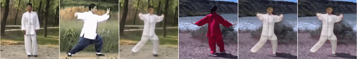
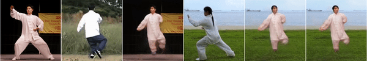

<h1> Image Animation (&BG SWAP) with Perturbed Masks </h1>

This repo presents an extensions to the method in paper Image Animation with Perturbed Masks - Yoav Shalev, Lior Wolf.

Paper - https://arxiv.org/pdf/2011.06922v2.pdf

Code - https://github.com/itsyoavshalev/Image-Animation-with-Perturbed-Masks

The extended model receives an optional independent third image and the background of this third image is merged in the animated source image by the driving video.

<h2> Approach </h2>

<b> Keypoint </b> - Use the masks generated by the method in order to segment the foreground from the background of two frames and merge the results .

A 2-step generator which consists of 2 Encoder Decoder based models was trained in a self-supervised manner in order to merge the results. As in the paper, the networks were trained using two frames from the same video.

Denote by  - m(x) the output of the mask generator for image x. Notice x is 256x256 but m(x) is 64x64.
            bi(x) the binary mask obtained by thresholding m(x).
            U(x) and D(x) the upsampled and downsampled version of x, obtained via bilinear interpolation.
            F(x, bi(x)) and B(x, bi(x)) the foreground and background segmented respectively w.r.t to the binary mask bi(x).

For a source image X and a driving image Y of size 256x256 -

The first model BGBase receives 8 channels of 64x64 images as input and outputs one low-resolution image of size 256x256.

out = BGBase(  concat( m(X), m(Y), F(D(Y), bi(Y)), F(D(X), bi(X)) ))

The second model BGRefine receives 11 channels of 256x256 images as input and outputs one high-resolution image of size 256x256.

out_hd = BGRefine(out, U(m(X)), U(m(Y)),  F(Y, U(bi(Y))), F(X, U(bi(X)))

Each of the network is trained to minimize the multi-scale perceptual loss (using first, the third and the fifth ReLU layers of VGG-19 identically to paper) between its output and the driving target image (the networks "see" only the foreground of this image).

The masks inputs m(X) and m(Y) are detached from their computational graph and passed to the models s.t this extension does not affect the original method and its results.
Also, backpropagation occurs in each of the networks separately.

Notice the architecture of BGBase and BGRefine are identical to the architecture of low-resolution and high resolution generator L and H in paper respectively.

The networks was trained along with the original method. Both networks are deactivated for the first 2 epochs, just to wait mask generator m to output significant masks. 

** Note - in current model there might be redundancy when using the masks m(X),m(Y) as input since they are easy to deduce by the extracted foreground and background - this needs to be checked in future version and can potentially speed up and reduce size of model.

<h2> Inference </h2>

At inference time, I divided it to 2 cases - 
Case 1 : the third image (which we want its background) is from the same type, in this case we can use its mask obtained by the mask generator, in order to remove the current 
foreground of this third frame from the output.

Case 2 : the third is not from the same type, in this case we cannot remove directly its foreground, instead of applying the mask generator m to this image, we associate it with a all-black binary mask (no foreground).

<h2> Results </h2>

Notice the original method needs to be trained for 100 epochs thus there is a bottleneck in the overall performance but the background swap results are clearly satisfying.

After 13 epochs - From left to right

 (Source image, Driving video, Original method output, Third (BG) image , BGBase output, BGRefiner final output )

